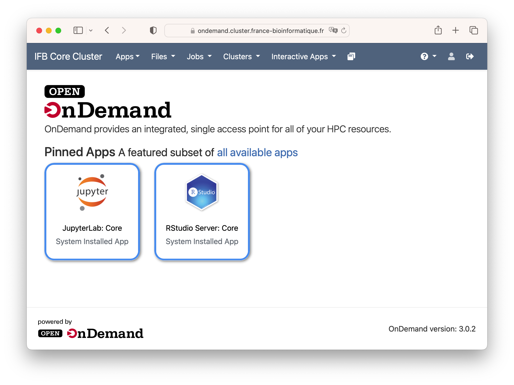

# Welcome to Open OnDemand hosted by IFB cluster

## About

The OnDemand portal serves as a unified, browser-based gateway to all your high-performance computing (HPC) resources within the IFB cluster.

Open OnDemand simplifies tasks by offering a graphical interface to view, edit, download, and upload files. Users can manage and create job templates for the IFB cluster, as well as access various interactive applications like Virtual Desktop, Jupyter Notebooks, RStudio and more. These functionalities are performed through a web browser, requiring minimal familiarity with Linux and scheduler commands.

## Highlights

Open OnDemand has a number of strengths that make it a user-friendly and adaptable solution for accessing HPC resources:

1. User-friendly interface for easy access to HPC resources.
2. Simple file and task management via a web-based interface.
3. Access to interactive applications such as Virtual Desktop, Jupyter Notebooks, RStudio, etc.
4. Reduced complexity, requiring minimal technical knowledge.
6. Open-source platform fostering collaboration.
7. Adaptability to diverse computing environments.
